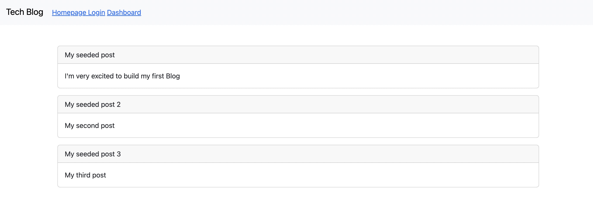

# Model View Controller Tech Blog

## Description
This project was created for the week 14 challenge of my bootcamp. The goal of this challenge is to build a CMS style blog site similar to Wordpress site, where developers can publish their blog posts and comment on another developer's posts as well. 

## Installation
Deoployed in Heroku

## Usage
## Credits

## License
